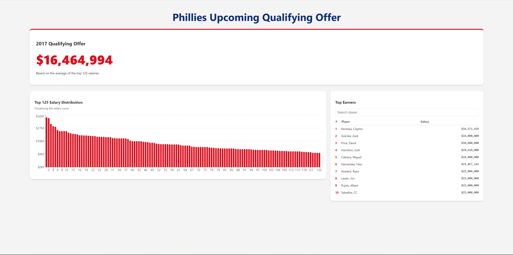

# Phillies Qualifying Offer Calculator

A React application that determines the monetary value of the upcoming qualifying offer and displays the amount along with visualizations such as Histograms and Table with search functions.


## Features
- Fetches live data on every load to ensure accuracy
- Utilizes DOM Parse and Regex cleaning to handle malformed data
- Identifies latest year in the dataset and filter for the "past season" dynamically
- Filters for the MLB Level only
- Uses the Recharts library to visualize the distribution of the top 125 earners
- A searchable table that allows users to search for players' exact salary within the dataset

## Tech Stack

* **Framework:** React 18 + Vite
* **Visualization:** Recharts
* **Data Processing:** Native JavaScript (`fetch`, `DOMParser`, `Array` methods)

## How to Run Locally
- This application uses the Vite Proxy to route requests to access the database

### Prerequisites
* Node.js (v14 or higher)
* npm (usually comes with Node)

### Installation Steps

1.  **Clone the repository:**
    ```bash
    git clone [https://github.com/mperform/Phillies-take-home.git](https://github.com/mperform/Phillies-take-home.git)
    ```

2.  **Install dependencies:**
    ```bash
    npm install
    ```

3.  **Start the development server:**
    ```bash
    npm run dev
    ```

4.  **Open the Application:**
    Click the URL shown in your terminal (usually `http://localhost:5173/`).

## Notes
- AI was used for CSS styling, syntax lookup, and visualization graphing.